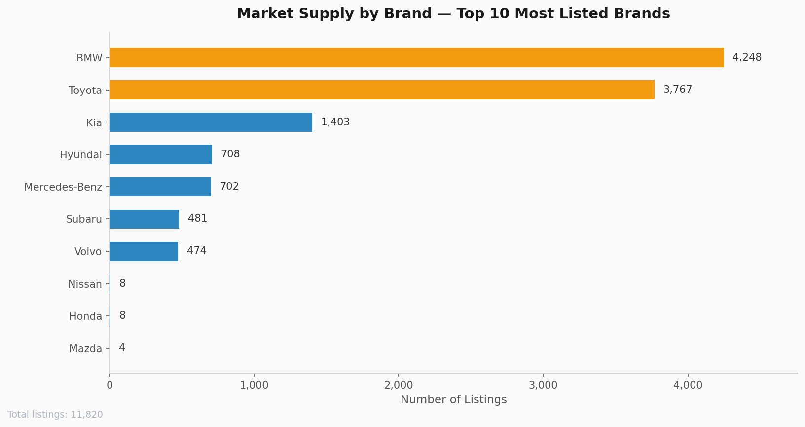
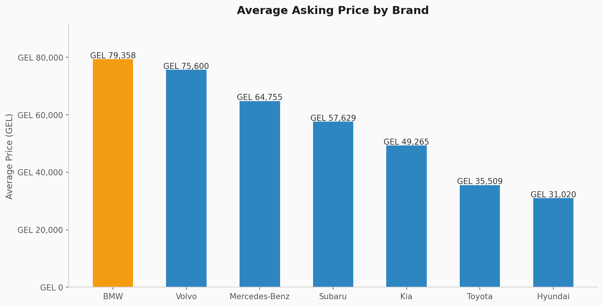
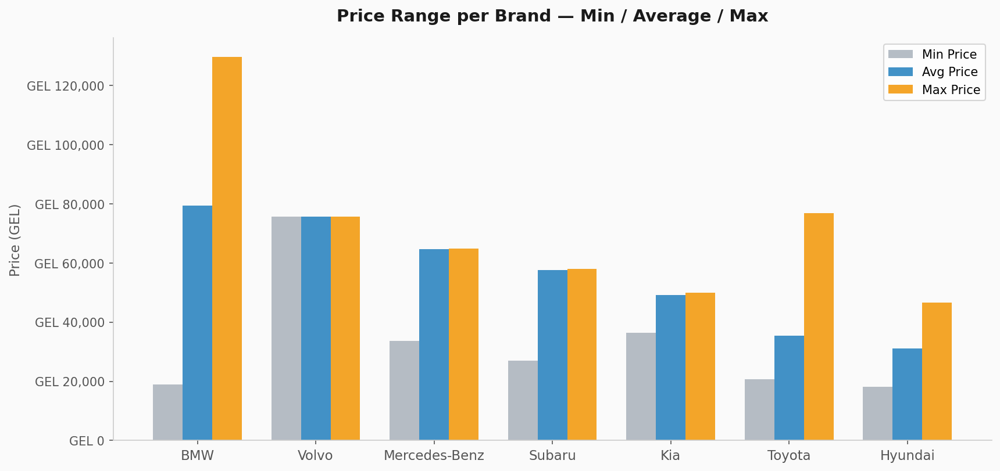
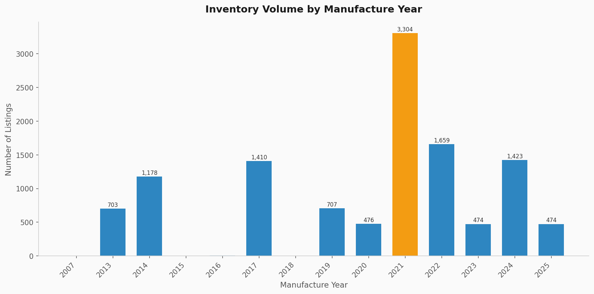
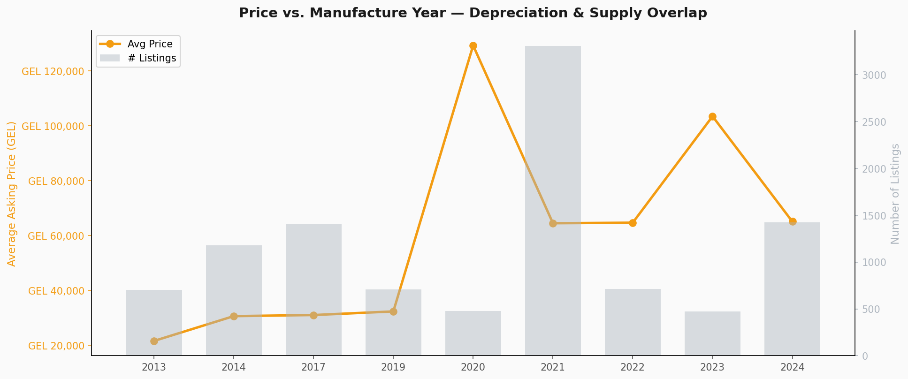
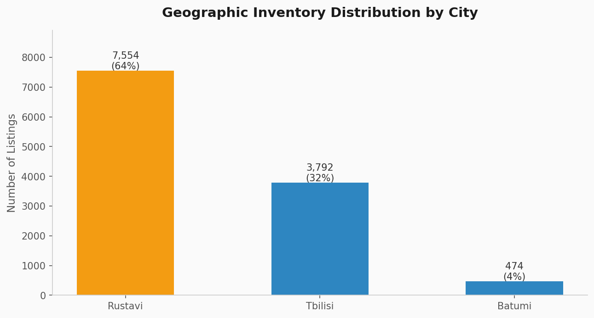
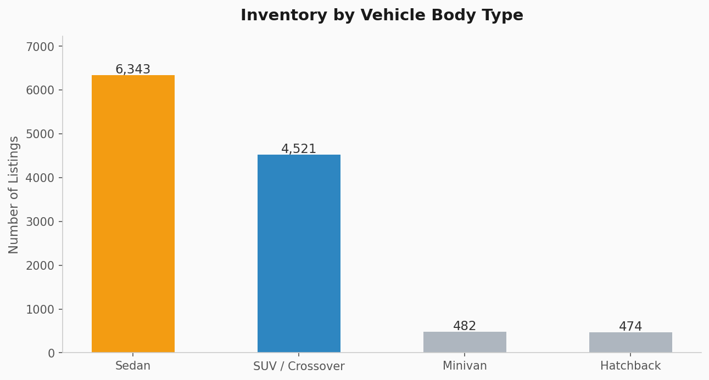
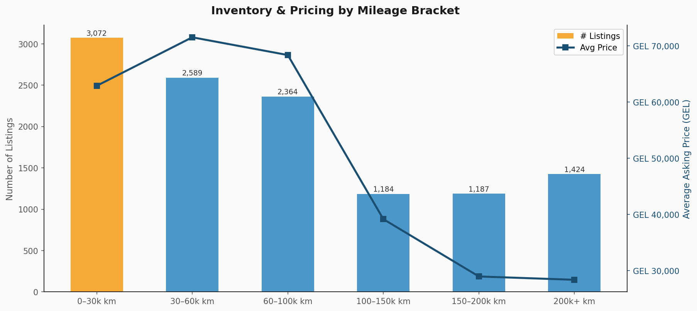
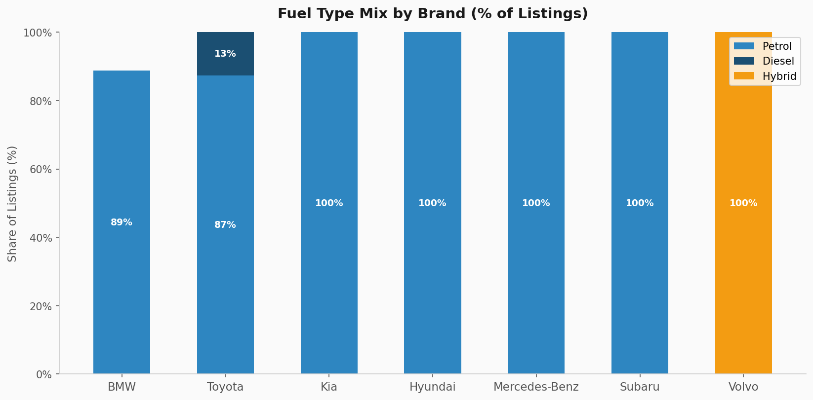
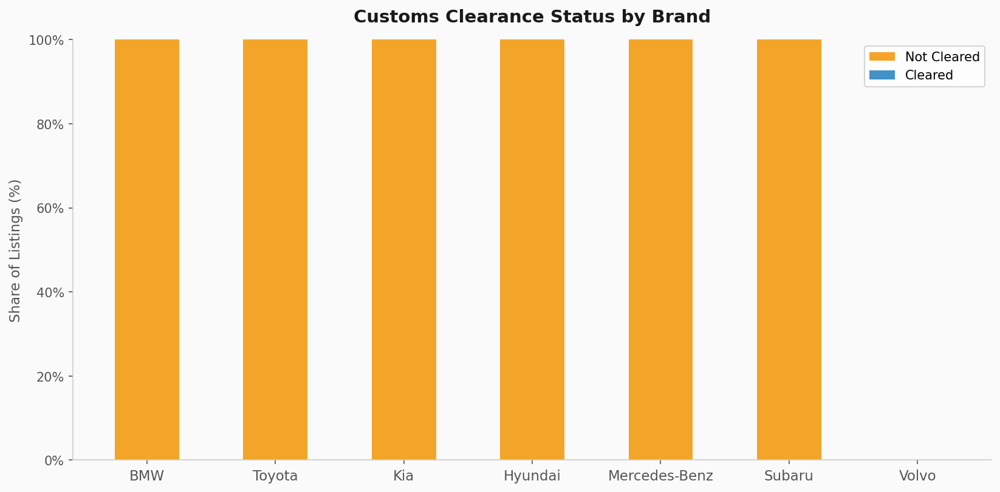

# Georgia Used-Car Market — Business Insight Report

> **Data source:** ap.ge (Autopapa) — Georgia's primary automotive marketplace
> **Dataset:** 11,820 active listings across 1,196 search pages
> **Currency:** Georgian Lari (GEL)

---

## Executive Summary

The Georgian used-car market is heavily concentrated — two brands account for nearly
70 % of all supply, one city holds 64 % of all inventory, and almost every listed
vehicle carries an outstanding customs obligation. These structural patterns create
clear opportunities for buyers, dealers, and investors who understand where the
volume is, how prices behave across age and mileage, and where supply gaps exist.

---

## 1. Brand Landscape — Who Dominates Supply

**BMW and Toyota together represent 68 % of all listings** (≈ 8,000 of 11,820).
No other brand comes close: Kia ranks third at roughly 12 %, and the remaining
brands each hold single-digit shares.

**What this means:**
- Dealers and buyers have the widest selection and strongest price competition
  in the BMW and Toyota segments — negotiating power sits firmly with buyers.
- Niche brands (Volvo, Subaru, Mercedes-Benz) offer far fewer options, which
  can drive premium pricing and faster turnover for sellers in those segments.
- Any platform or dealer strategy targeting volume should lead with BMW and Toyota
  inventory, while niche brands can be positioned as premium, low-competition offerings.

---

## 2. Pricing by Brand — Where the Money Is

| Brand | Avg Price (GEL) | Notes |
|---|---|---|
| BMW | 79,358 | Widest price spread; entry-level and premium coexist |
| Volvo | 75,600 | Consistent premium positioning |
| Mercedes-Benz | 64,755 | Tight range — mostly one model tier |
| Subaru | 57,629 | Mid-premium, narrow spread |
| Kia | 49,265 | Consistent mid-market |
| Toyota | 35,509 | Broadest volume, entry-to-mid pricing |
| Hyundai | 31,020 | Most affordable brand in market |

**What this means:**
- **BMW carries the highest average price AND the highest volume** — making it
  the market's most commercially significant brand by total transaction value.
- **Toyota is the accessible volume leader** — its lower average price combined
  with high listing count suggests it is the primary entry point for buyers
  entering the market.
- **Hyundai and Toyota** serve price-sensitive buyers; a dealer concentrating on
  these two brands serves the broadest possible demand base.

---

## 3. Fleet Age — What Years Are Available

**2021-model vehicles account for 28 % of all listings** (3,304 units) — by far
the single largest cohort. The next largest groups are 2017 (1,410 units) and
2024 (1,423 units). Very recent models (2023–2025) and older models (pre-2013)
are relatively scarce.

**What this means:**
- The 2021 cohort represents cars that are 3–4 years old — old enough to have
  shed initial depreciation, yet modern enough to carry desirable features.
  This is the market's "sweet spot" for volume deals.
- The spike in 2024 listings signals that new-model imports are arriving in
  meaningful quantities, presenting an opportunity for premium positioning.
- Cars from 2013–2014 still represent a sizeable affordable segment for
  buyers with tight budgets.

---

## 4. Depreciation Curve — How Age Affects Price

Price follows a clear depreciation arc from older models to 2019, then jumps
sharply for 2020–2023 vehicles before moderating again for 2024. The
**2020–2023 range commands prices 2–3× higher than pre-2018 stock**.

**What this means:**
- Buyers seeking the best value-per-GEL should focus on 2017–2019 vehicles
  (moderate age, still well-equipped, meaningful price discount vs. 2021+).
- Sellers holding 2021–2023 inventory are in the strongest pricing position
  in the current market.
- The pronounced price gap between pre-2020 and post-2020 vehicles creates
  two distinct buyer segments that should be marketed and priced separately.

---

## 5. Geographic Concentration — The Rustavi Effect

**Rustavi holds 64 % of all listings (7,554 units)**, dwarfing Tbilisi (32 %)
and Batumi (4 %). This is largely driven by Autopapa's own dealer lot in Rustavi.

**What this means:**
- The market is not evenly distributed — a buyer outside Tbilisi or Rustavi
  has very limited local choice and will likely need to travel.
- For a platform or marketplace, **Tbilisi represents the largest underserved
  geographic opportunity**: high population, only 32 % of current supply.
- Dealers in Batumi or other cities face almost no local competition from
  this platform's inventory, making regional expansion a low-risk move.

---

## 6. Vehicle Type — Sedans vs. SUVs

**Sedans lead at 54 % of supply (6,343 units), followed by SUVs / Crossovers
at 38 % (4,521 units).** Minivans and hatchbacks together account for only 8 %.

**What this means:**
- Sedan buyers have the largest selection and most competitive pricing.
- SUV / crossover inventory is substantial but trails sedans — a buyer wanting
  an SUV has meaningful choice without the hyper-competition of the sedan market.
- Minivans and hatchbacks are scarce; a specialist dealer in these segments
  could command a price premium with limited direct competition.

---

## 7. Mileage — Condition Tiers and Their Prices

| Mileage Tier | Listings | Avg Price |
|---|---|---|
| 0 – 30,000 km | ~1,400 | Highest |
| 30 – 60,000 km | ~1,900 | High |
| 60 – 100,000 km | ~3,000 | Mid |
| 100 – 150,000 km | ~2,800 | Mid-Low |
| 150 – 200,000 km | ~1,700 | Low |
| 200,000+ km | ~900 | Lowest |

**The 60–100k km bracket holds the most listings** and represents the market's
primary volume tier — vehicles that have seen meaningful use but still have
significant life remaining.

**What this means:**
- The sharpest price drop occurs between the 0–30k and 100k+ brackets —
  buyers who can tolerate slightly higher mileage unlock substantial savings.
- High-mileage stock (150k+) is present but limited — creating a potential
  niche for buyers seeking the lowest entry price.
- Dealers should stock the 60–100k km range to align with peak buyer demand.

---

## 8. Fuel Type — Petrol Dominates, Hybrid Growing

**Petrol vehicles account for the overwhelming majority of listings across all
brands.** Hybrid inventory is present but concentrated in specific brands (notably
Volvo and select Toyota models). Diesel is a small minority.

**What this means:**
- Petrol infrastructure and buyer familiarity make it the safe default for
  dealer inventory.
- Hybrid listings command above-average prices and appeal to a cost-conscious,
  environmentally aware buyer segment — a growing niche worth monitoring.
- Diesel demand appears limited in this market; stocking diesel vehicles carries
  higher liquidation risk.

---

## 9. Customs Clearance — A Market-Wide Risk Factor

**Over 86 % of all listed vehicles (≈ 10,166 units) have not yet cleared
Georgian customs.** This is consistent across virtually every brand.

**What this means:**
- The true cost of purchase is higher than the listed price for most buyers —
  customs duties must be factored into any buying decision.
- Dealers or platforms that offer **customs-cleared inventory** hold a meaningful
  competitive advantage: buyers can purchase and drive without bureaucratic delay.
- For a marketplace platform, prominently surfacing customs-cleared listings
  could be a significant conversion driver.

---

## Key Actions for Stakeholders

| Stakeholder | Recommended Action |
|---|---|
| **Buyer** | Focus on 2017–2019 Toyota or Hyundai, 60–100k km range for best value |
| **Dealer / Importer** | Lead inventory with 2021+ BMW and Toyota; offer customs-cleared stock as premium tier |
| **Platform / Marketplace** | Expand Tbilisi presence; surface customs-cleared listings prominently |
| **Investor** | Hybrid and SUV segments show strongest price resilience; minivan niche is underserved |
